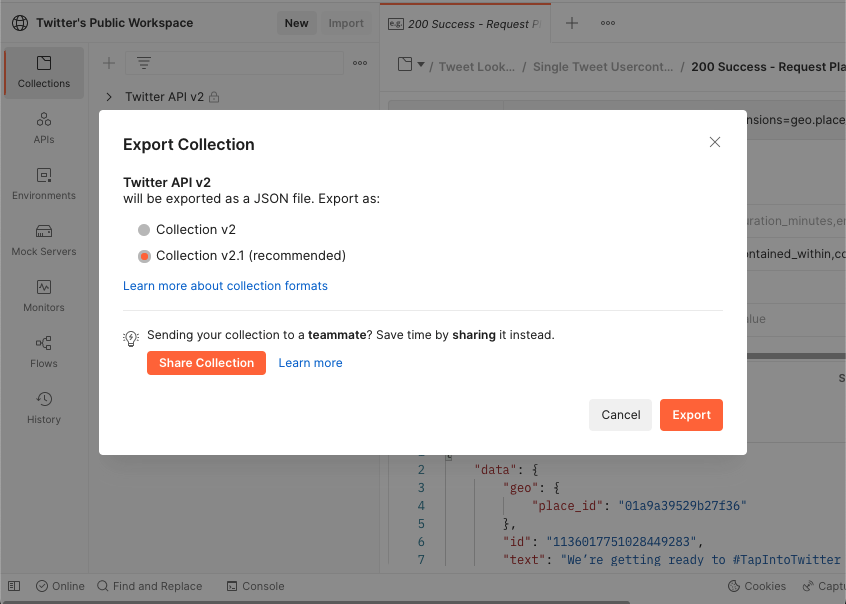

## Creating an OpenAPI specification file

To have an API Mock Server, it’s required to have an [OpenAPI](/development/documentation/openapi/) specification file (e.g., `openapi.yml`) to document API requests.

**OpenAPI specification file from Postman collection**

In case the team has an existing Postman collection, developers can generate an OpenAPI specification file from the Postman collection and put it into the folder `docs/openapi` by following these steps:

1. Select the Postman collection and export it as a collection v2.1 JSON file.
    

2. Take the newly generated JSON file and convert it to an OpenAPI specification file by using this [postman-to-openapi](https://github.com/joolfe/postman-to-openapi)

    ```bash
    p2o ./path/to/PostmantoCollection.json -f ./docs/openapi/openapi.yml
    ```
