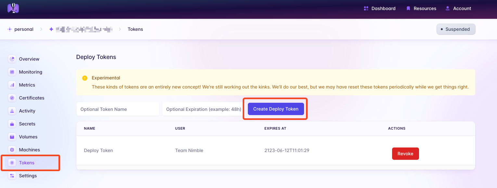

<p align="center">
    <picture>
      <source media="(prefers-color-scheme: dark)" srcset="https://assets.nimblehq.co/logo/dark/logo-dark-text-320.png">
      
    </picture>
</p>

<p align="center">
  <strong>API Mock Templates</strong>
</p>

---

Our optimized API mock templates to create API mock servers.

## Getting Started

### Prerequisites

[](https://nodejs.org/download/release/v18.15.0/)
[](https://www.docker.com/products/docker-desktop/)
[](https://fly.io/docs/hands-on/install-flyctl/)

### Use the template

1. Create a new repository for API Mock Server by pressing the `Use this template` button in this repository.
2. Clone your repository.
3. Configuration for fly.io and CD:
  - Run `fly launch --dockerfile Dockerfile.mock` to create a new app on your `fly.io` account and answer these questions:
    |Questions|Answers|
    |---|---|
    |Would you like to copy its configuration to the new app?|Yes (`y`)|
    |Choose an app name|Leaving blank (`api-mock-server`) or choose a new app name|
    |Would you like to set up a Postgresql database now?|No (`N`)|
    |Would you like to set up an Upstash Redis database now?|No (`N`)|
    |Create .dockerignore from 1 .gitignore files?|No (`N`)|
    |Would you like to deploy now?|No (`N`)|

  - After launching a new app, to be able to deploy the application via GitHub Actions, developers need to create a `Deploy Token` for the project.
    - Go to application dashboard > Tokens > Create Deploy Token
      
    - Add the created Deploy Token as a secret to the repository with the key name: `FLY_API_TOKEN`.

4. Configure for publishing wiki documentation:

    Add these secrets to the repository:
      - `GH_EMAIL`: The email address of the GitHub account that will be used to publish the wiki documentation.
      - `GH_TOKEN`: The personal access token of the GitHub account with `repo` scope enabled that will be used to publish the wiki documentation.

### Development

- Install dependencies:

  ```sh
  make install-dependencies
  ```

- Generate the OpenAPI specification (public/openapi.yml):

  ```sh
  make doc/generate
  ```

- Start the dev server:

  ```sh
  make dev
  ```

The applications are reachable at:

- OpenAPI Swagger UI for visualizing the API documentation: http://localhost:8080
- Mock server: http://localhost:4010

## License

This project is Copyright (c) 2014 and onwards Nimble. It is free software and may be redistributed under the terms specified in the [LICENSE] file.

[LICENSE]: /LICENSE

## About

<picture>
      <source media="(prefers-color-scheme: dark)" srcset="https://assets.nimblehq.co/logo/dark/logo-dark-text-160.png">
      
</picture>

This project is maintained and funded by Nimble.

We love open source and do our part in sharing our work with the community!
See [our other projects][community] or [hire our team][hire] to help build your product.

[community]: https://github.com/nimblehq
[hire]: https://nimblehq.co/
